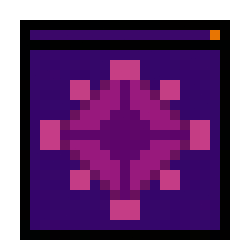

<!-- PROJECT LOGO -->
 

  

<h3 align="center">Funkin Compiler</h3>

  

    The simple program to both develop and compile V-Slice mods in a more comfortable enviroment than a notepad.
     
     
    ·
    <a href="https://github.com/FunkinCompiler/FunkinCompiler/issues">Report Bug or Request Feature</a>
    ·
    <a href="https://github.com/FunkinCompiler/FunkinCompiler/pulls">Create Pull Request</a>
  

## How to Install

1. Install both Haxe and Git
2. Use ``haxelib setup`` to create an empty repo for dependencies.
3. Download the program (either from releases or a action build)
 - The program will remind you if you forget to do that
4. Run it (On linux you have to run it from the console)
 - The program Doesn't contain any GUI, so everything will be done from the console
5. select  `setup` from the menu
6. Once done, you can customise some settings from ``funk.cfg`` file

## How to use

#### Making a new project

To create a new project, run the program select `new`. 
You will be prompter for it's name and you can now start working on your mod.

#### Working on the project

Open the newly created project in VSCode or a fork based on it. Head over to the extensions tab and istall all recomended extensions.

Make sure to set taget compilation to your sys platform (there should be a small text on the bottom bar to quickly change it)

[Here is a TTW file documenting the project's structure](./GETTING_STARED.md)
